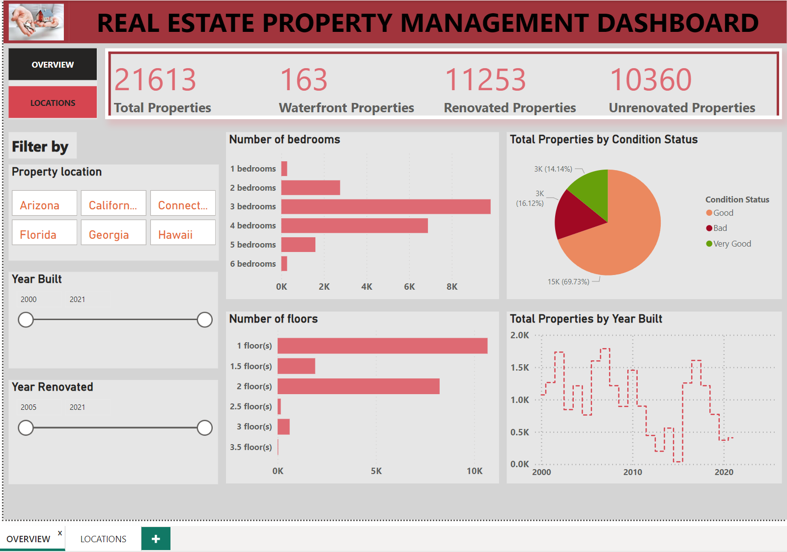

# Real-Estate-Property-Management-Dashboard

## Description
The Real-estate data from Kaggle website is tranformed,cleaned and analysed using Power BI.This dashboard gives a wonderful insight about the property available in the market for sale with lots of inputs like the condition,year built,year renovated,location waterfront or no,number of rooms and the prices according to the location.

## Steps performed in the project.
1. The input data file "Housing Dataset.xlsx" is loaded into PowerBI desktop.
2. The columns which is of no use for the analysis is removed from the loaded datafile in PowerQuery.
4. New columns are added to make our analysis easy.
5. Dimensional tables are created .
6. The data is tranformation is completed using PowerQuery.
7. Data Modelling is done to establish a relationship between the fact and dimensional tables.
8. Different measures are calculated to find the total numebr of properties and the waterfront properties available for sale , and also the number of renovated and unrenovated properties.
9. All the data are visualised using the POWERBI Visual.

## Summary of findings
1. Created multi card visual showing the total number of properties, renovated and unrenovated properties and waterfront properties.
2. Created slicers to display the properties based on location,year built and year renovated.
3. Created bar charts displaying the properties based on the number of bedrooms and number of floors in the property.
4. Created a pie chart to showcase the condition of the property.
5. The line chart also diplays a graph showing the number of properties built each year.
